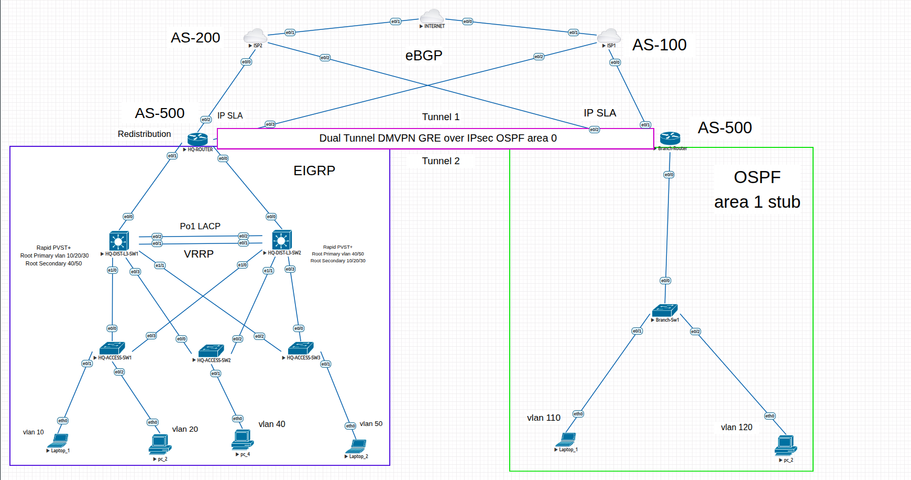

# Enterprise Multi-ISP Cisco Infrastructure Stack

Enterprise-grade Cisco network architecture fully simulated and validated in EVE-NG. 

The objective of this project was to design and validate an enterprise network that prioritizes high availability, resilient WAN connectivity, secure campus access, and controlled interoperability between multiple routing domains while following production-oriented design principles.

---

## 🌐 Enterprise Network Overview
---

## 🗺️ Network Topology

*Note: The source EVE-NG `.unl` topology file is available in the root directory of this repository for lab replication.*

A high-impact, scannable overview of the implemented architecture:

* **Topology Core:** Corporate Headquarters + Redundant Remote Branch
* **WAN Edge:** Dual ISP Connectivity with dynamic primary/backup active failover
* **Secure VPN Overlays:** Dual-Tunnel Dynamic Multipoint VPN (DMVPN Phase 3)
* **WAN Routing Underlay:** eBGP peering with public service providers
* **WAN Routing Overlay:** OSPF over DMVPN tunnels
* **Campus LAN Core:** EIGRP-based Named-Mode campus Core/Distribution layer
* **Edge Interoperability:** Mutual Redistribution with Route-Maps & Route-Tag loop prevention
* **First Hop Redundancy:** VRRP for local gateway resilience
* **Layer 2 Infrastructure:** Rapid Per-VLAN Spanning Tree (RPVSTP+) & LACP EtherChannel
* **Path Monitoring:** IP SLA + Object Tracking for real-time link health verification
* **Edge Security:** Policy-Based PAT (NAT Overload) using advanced Route-Maps
* **LAN Hardening:** Layer 2 protection against rogue DHCP servers, ARP spoofing, and unauthorized endpoint access.

---

## 🎯 Design Goals

The core engineering objectives behind the technological choices made in this project:

* ✔ **High Availability:** Elimination of single points of failure across both the LAN core and WAN edge.
* ✔ **Dynamic WAN Failover:** Automated path shifting during primary ISP degradation without manual intervention.
* ✔ **Fast Convergence:** Fast convergence through redundant design and dynamic failover mechanisms.
* ✔ **Secure Campus LAN:** Layer 2 protection against rogue DHCP servers, ARP spoofing, and unauthorized endpoint access.
* ✔ **Enterprise Scalability:** Designed to support future branch expansion using a scalable DMVPN architecture.
* ✔ **Routing Plane Isolation:** Strict separation maintained between WAN service provider boundaries and internal routing domains.
* ✔ **Future NGFW Readiness:** The topology was designed with dedicated transit links to allow future insertion of a Next-Generation Firewall (NGFW) without redesigning the Layer 3 architecture.
* ---

## 🛠️ Detailed Technical Documentation

To keep the overview concise, the complete low-level engineering specifications, subnet allocations, and failover design parameters have been segmented into dedicated architectural documents:

* 📊 **[Addressing & VLAN Plan](docs/addressing-and-routing.md)** – Comprehensive subnet tables for HQ LAN, Remote Branch, and WAN point-to-point links.
* 🔄 **[WAN Path Selection & Failover Matrix](docs/addressing-and-routing.md#-wan-path-selection--failover-matrix)** – Detailed logic covering IP SLA configuration, Object Tracking, and eBGP/OSPF convergence behaviors during link failures.
* ---

## 🔍 Infrastructure Verification & Validation

To review the live state validation of the network control plane, DMVPN overlay, security associations, and high-availability tracking, please refer to the complete verification document:

---

## 🛠️ Network Troubleshooting 

Hands-on engineering is all about solving complex challenges. During the implementation of this multi-vendor infrastructure, I documented key technical issues, their root causes, and my step-by-step resolution processes:

*   **[Case Study 1: Broken NAT Translations During ISP Failover](troubleshooting/troubleshoot_1.md)**  
    *Resolving persistent NAT translation states on dual-homed edge paths during a simulated ISP-2 blackout.*
*   **[Case Study 2: Mutual Redistribution & Routing Loops (EIGRP & OSPF)](troubleshooting/troubleshooting_2.md)**  
    *Fixing "Infinity Metric" values in EIGRP Named-Mode and implementing Route-Maps with Route-Tagging to eliminate feedback loops.*

---
