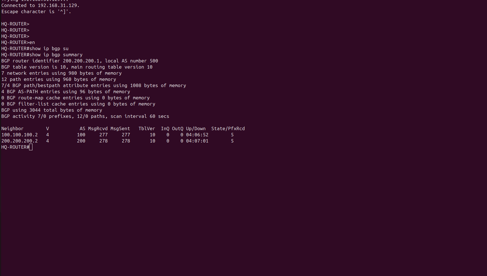
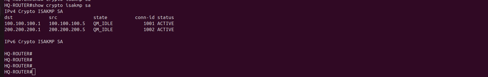
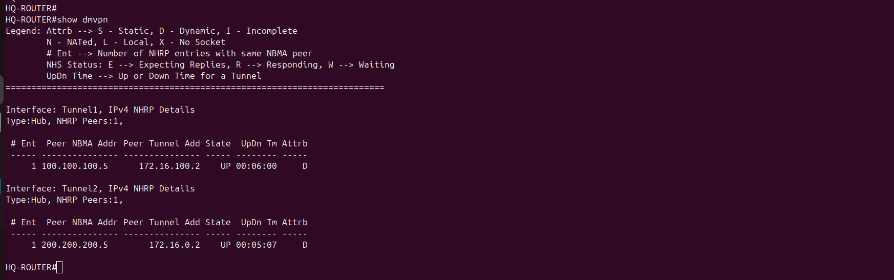
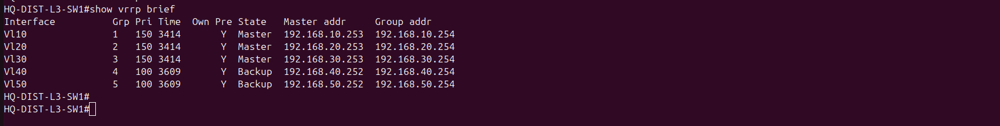
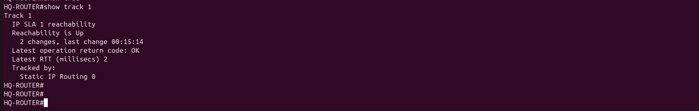

# 🔍 Infrastructure Verification Guide

This document outlines the systematic verification commands used to validate control plane stability, overlay infrastructure health, and deterministic data plane forwarding behavior across the multi-vendor environment.

---

## 🌐 1. Dynamic Routing Verification

### Underlay BGP Peer Validation
To verify that the Edge Routers successfully establish eBGP peerings with the service providers (ISP-1 and ISP-2) and receive correct routing advertisements:

---

## 🔒 2. DMVPN Phase-3 & IPsec Validation

### Crypto ISAKMP State Verification
Ensuring that Phase 1 security associations (SAs) are fully negotiated and active (`QM_IDLE`) before overlay traffic encryption:

### DMVPN Overlay & NHRP Mapping
Validating the dynamic Next Hop Resolution Protocol (NHRP) registration matrix on the Hub interface for all connected Spoke routers:

---

## 🔄 3. High Availability & Path Tracking

### VRRP Gateway Redundancy
Verifying First Hop Redundancy Protocol (FHRP) state behavior at the core/distribution layer for high-availability gateway redundancy:

### IP SLA & Object Tracking Verification
Validating that the continuous tracking engine accurately evaluates the primary ISP link viability to trigger deterministic path failover:

